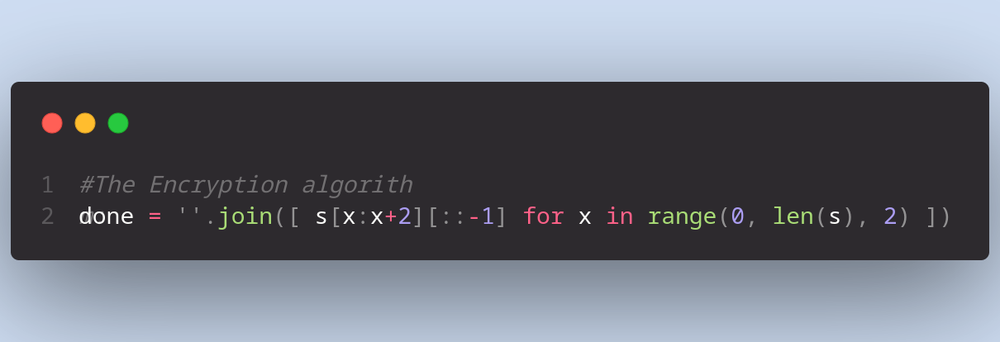

# this is Gui python application 

## This is to just show implementation

###### using Tkinter

 Using Tkinter to create a simple gui to encrypt a message and decrypt it thats all, no fancy gui works as Tkinter poses difficult in making 
 the gui more fancy 

